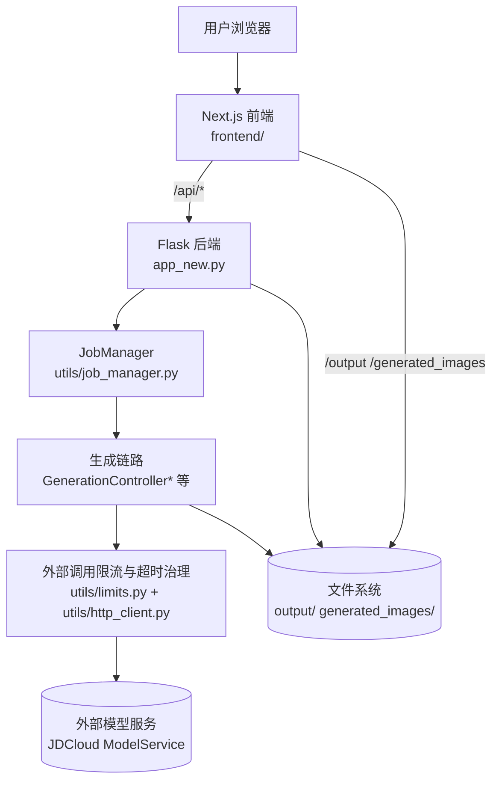
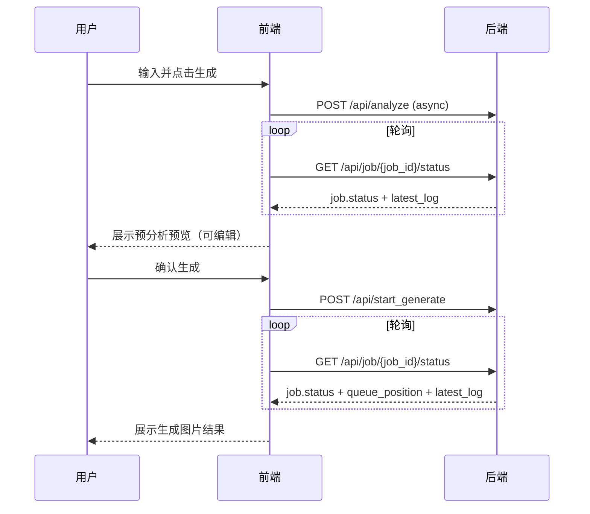

# 架构设计

## 总体架构

## 技术栈
- **后端:** Python / Flask
- **前端:** Next.js / React / TypeScript
- **任务:** 后端 JobQueue（并发控制 + 排队）
- **存储:** 文件系统为主（无数据库依赖）

## 核心流程

## 重大架构决策
完整 ADR 记录在各变更的 `how.md` 中，本章节提供索引。

| adr_id | title | date | status | affected_modules | details |
|--------|-------|------|--------|------------------|---------|
| ADR-001 | 方案1保持单进程状态一致性 | 2026-02-02 | ✅已采纳 | backend | [how.md](../history/2026-02/202602022301_perf_4x_throughput/how.md) |
| ADR-002 | 外部调用使用独立配额池并统一重试 | 2026-02-02 | ✅已采纳 | backend | [how.md](../history/2026-02/202602022301_perf_4x_throughput/how.md) |

