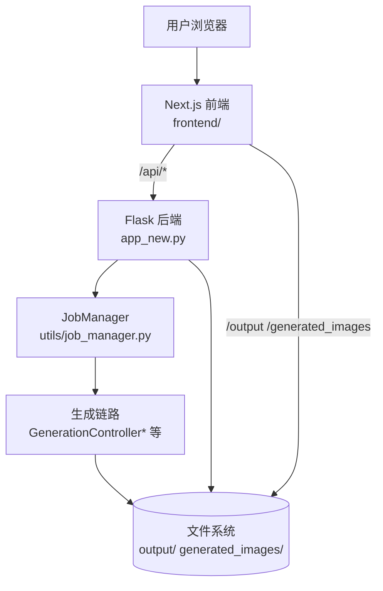
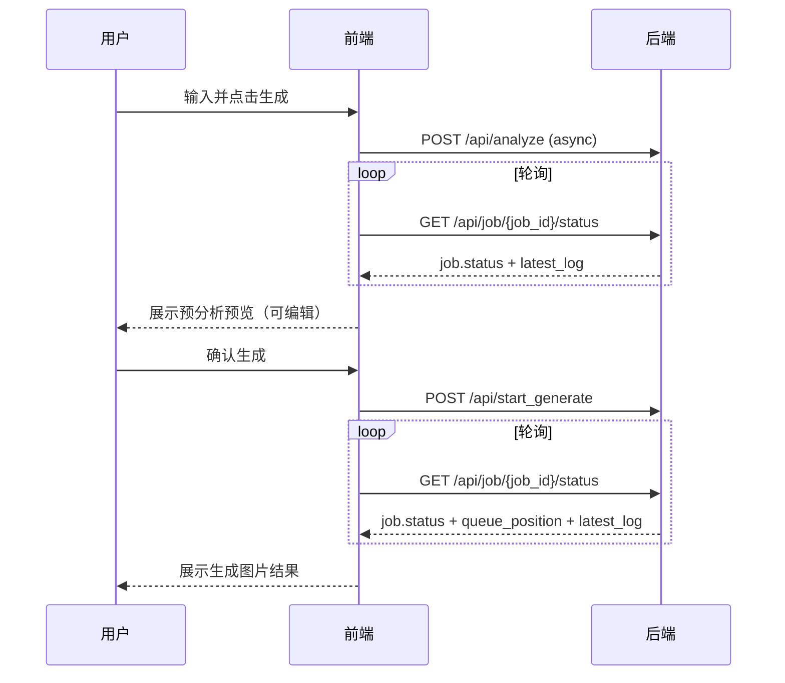

# 架构设计

## 总体架构

## 技术栈
- **后端:** Python / Flask
- **前端:** Next.js / React / TypeScript
- **任务:** 后端 JobQueue（并发控制 + 排队）
- **存储:** 文件系统为主（无数据库依赖）

## 核心流程

## 重大架构决策
当前暂无独立 ADR 索引（后续在变更的 `how.md` 中维护并在此处追加链接）。

